# 🌌 Milky Way Globular Cluster Atlas
# 银河系球状星团大星表 · 轨道 · 恒星流 · 3D 交互可视化

一个**数据精确、完全本地、可交互**的银河系球状星团综合项目：从国际权威天文数据库
(CDS VizieR + galstreams) 抓取多个权威星表，交叉证认合并成统一主星表，在标准银河
引力势中做轨道积分，并以出版级静态图 + **自包含 3D Web 应用**两种形式呈现。

> A precise, fully-offline, interactive atlas of **Milky Way globular clusters**:
> multi-survey catalog cross-match (Harris / Vasiliev & Baumgardt / Baumgardt & Hilker /
> Bica), **orbit integration** in MWPotential2014, **124 stellar streams** (galstreams),
> plus a **scientific spiral-arm & bar model** — all rendered in a zero-install,
> double-click **3D web explorer** (Three.js).

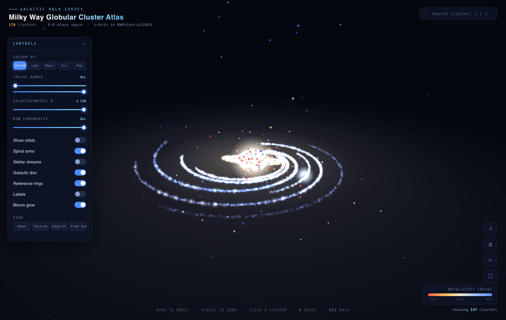

## 🔴 在线演示 Live Demo

**https://jianxing-chen.github.io/globular-cluster-atlas/viz/**

打开即玩，无需安装（GitHub Pages 托管，完全静态）。

---

## ✨ 亮点 Highlights

| 项目 | 内容 |
|------|------|
| **统一主星表 Master catalog** | **176** 个球状星团，多源交叉证认合并 |
| **6D 相空间** | **135** 个星团拥有完整 位置+自行+视向速度 |
| **轨道积分 Orbits** | **135** 条平滑轨道，MWPotential2014 反推 3 Gyr |
| **恒星流 Streams** | **124** 条银河恒星流（galstreams），18 条关联祖源星团 |
| **银河系结构** | 科学仿真的旋臂（4 主臂+本地臂+Outer）+ 中心棒 + 核球 |
| **静态科学图** | 6 张出版级 PNG |
| **3D Web 应用** | 完全本地、双击即开、零安装、零联网、~120 fps |

---

## 🚀 快速开始 Quick Start

### 3D 交互可视化（无需任何安装，双击即开）
```bash
git clone git@github.com:jianxing-chen/globular-cluster-atlas.git
cd globular-cluster-atlas
# 用浏览器打开 viz/index.html 即可（双击 / open / 拖入浏览器）
open viz/index.html        # macOS
# start viz\index.html     # Windows
# xdg-open viz/index.html  # Linux
```
> **任何现代浏览器（Chrome / Edge / Firefox / Safari）双击即可运行**。
> 应用采用纯经典脚本（无 ES module、无网络请求、无 `file://` 限制），完全离线自包含。
> 也可部署到任意静态托管（含 GitHub Pages）——入口即 `viz/index.html`，无需构建。

**交互 Interactions：**
- **拖拽** 旋转 · **滚轮** 缩放 · **点击星团** 弹出完整信息卡
- **`/`** 聚焦搜索框，输入名称（如 `47 Tuc`、`omega Cen`、`M13`）→ 回车飞过去
- 左侧面板：5 种着色（金属丰度/光度/质量/偏心率/星族）、金属丰度/银心距/光度筛选、
  轨道开关、**旋臂结构**、**恒星流**、银河盘、参考环、标签、Bloom、4 种视角预设
- 信息卡：**Toggle orbit** 显示该星团轨道（平滑样条曲线），**Fly to** 飞向它

### 复现数据流水线 Reproduce the pipeline（可选 Optional）
```bash
cd scripts
python3 download_catalogs.py    # 1. 从 VizieR 下载原始星表
python3 parse_and_validate.py   # 2. 解析 + 校验
python3 build_master.py         # 3. 合并成统一主星表
python3 integrate_orbits.py     # 4. 轨道积分 (MWPotential2014)
python3 process_streams.py      # 5. 恒星流 (需先 clone galstreams 到 /tmp/galstreams)
python3 make_figures.py         # 6. 静态图
python3 export_viz_data.py      # 7. 打包给 Web 应用
```
依赖：`numpy pandas matplotlib scipy`（轨道/绘图无需 astropy/galpy，全自实现）。

---

## 📊 数据来源 Data Sources（全部经 VizieR 官方目录号核实）

| 星表 | VizieR 目录 | 内容 | 行数 |
|------|------------|------|------|
| **Harris 1996/2010** | `VII/202/catalog` | 坐标/距离/光度/[Fe/H]/E(B-V)/视向速度/结构/弛豫时间/密度（38 列） | 147 |
| **Vasiliev & Baumgardt 2021** | `J/MNRAS/505/5978/tablea1` | Gaia EDR3 自行 + 视差（→距离） | 170 |
| **Baumgardt & Hilker 2018** | `J/MNRAS/478/1520/table2` | 质量/质光比/半光半径/弛豫时间/逃逸速度/速度弥散 | 112 |
| **Bica et al. 2019** | `J/AJ/157/12/table3` | 银河系星团与候选总表（含新发现球状星团候选） | 10978 |
| **galstreams (Mateu 2023)** | `github.com/cmateu/galstreams` | 银河恒星流 6D 轨迹汇编（GD-1/Pal5/Orphan-Chenab 等） | 124 条流 |

**合并策略**：名称规范化（别名映射 Messier/常用名 → Harris 主键）+ 坐标交叉匹配
（容差 3′）。距离优先级 `Baumgardt&Hilker > Gaia 视差 > Harris`；坐标/自行取 Gaia EDR3；
金属丰度/消光/颜色取 Harris；质量/结构取 Baumgardt & Hilker。

**主星表字段覆盖**（176 个星团）：
有距离 170 · 有自行 170 · 有质量 118 · 有金属丰度 139 · 有视向速度 141 · 完整 6D **135**。

---

## 🌠 银河系结构仿真 Galactic Model（科学参数）

3D 场景中的银河系盘并非示意，而是按**权威文献参数**仿真绘制（细密的点状粒子）：

- **旋臂 Spiral arms**：4 条主臂（Scutum-Centaurus、Sagittarius-Carina、Perseus、
  Norma-Outer）+ Outer 臂 + 本地臂（猎户支臂），采用**对数螺旋**模型
  `R(β)=R_ref·exp(−(β−β_ref)·tan ψ)`，参数取自 **Reid et al. 2019**（ApJ 885, 131，
  VLBI 视差实测）与 **Vallée 2017** 综述，螺距角 8–16°。太阳位于本地臂（Orion Spur）。
- **中心棒 Bar**：半长 5 kpc、相对太阳-银心连线偏 28°（**Wegg et al. 2015**），
  叠加半径约 2 kpc 的花生状核球（b/p bulge）。
- **HII 亮斑**：沿主臂点缀的年轻恒星形成区亮斑。

### 恒星流 Stellar Streams（galstreams）
叠加了 **124 条银河恒星流**轨迹（Mateu 2023）。恒星流是球状星团/矮星系被银河系潮汐
撕裂的遗迹，与（被吸积的）球状星团物理上同源，共同讲述银河系的并合历史。
- **青色点带** = 一般恒星流；**金色点带** = 祖源为球状星团的流（Pal5、
  ω Cen-Fimbulthul、NGC3201-Gjoll 等，已自动关联到主星表对应星团）
- 散点密度渲染：平滑骨架加密采样 + 横向高斯散布模拟流宽
- 与球状星团/轨道严格同一参考系（同一套 IAU1958 银道变换）

---

## 🔬 轨道积分 Orbit Integration

- **引力势**：`MWPotential2014`（Bovy 2015）= Hernquist 核球 + Miyamoto-Nagai 盘 + NFW 晕，
  数值标定至 v_c(R☉)=238 km/s。
- **坐标变换**：自实现 IAU 1958 银道变换（经 47 Tuc 校验），日心→银心右手笛卡尔。
- **积分器**：`scipy DOP853`（8 阶 Runge-Kutta），反推 3 Gyr，rtol=1e-7。
- **太阳参数**：R☉=8.275 kpc，v☉=(11.1, 251.24, 7.25) km/s，z☉=20.8 pc。
- **输出**：每星团的平滑轨道轨迹 + R_peri / R_apo / 偏心率 / z_max / 顺逆行。

---

## ✅ 数据精确性校验 Validation

- **行数**：各表行数与 VizieR 完全一致（147 / 170 / 112 / 10978）。
- **坐标一致性**：Harris vs Gaia EDR3 角距离中位数 **0.048′**（≈3″）。
- **轨道自检**：太阳处圆周速度 **238.0 km/s**；47 Tuc 银道坐标 l=305.89°, b=−44.89°
  （文献 305.90, −44.89）；轨道起点与主星表坐标偏差 ≈0.02 kpc。
- **著名星团抽查**（与文献一致）：

| 星团 | 距离 | [Fe/H] | 质量 | 偏心率 |
|------|------|--------|------|--------|
| 47 Tuc (NGC 104) | 4.41 kpc | −0.76 | 7.79×10⁵ M☉ | 0.12（盘轨道）|
| ω Cen (NGC 5139) | 5.20 kpc | −1.62 | 3.55×10⁶ M☉（银河系最大）| 0.69 |
| M13 (NGC 6205) | 6.60 kpc | −1.54 | 4.53×10⁵ M☉ | 0.81 |

---

## 📁 目录结构 Structure

```
GlobularClusterAtlas/
├── viz/                      # ★ 3D Web 应用（完全自包含，双击 index.html 即开）
│   ├── index.html
│   ├── app.js                # Three.js 应用逻辑（纯经典脚本，无 module）
│   ├── gc_data.js            # 176 球状星团 + 135 轨道
│   ├── streams_data.js       # 124 恒星流
│   └── assets/               # three.min.js + OrbitControls（本地化，离线可用）
├── data/
│   ├── raw/                  # VizieR 原始 TSV（4 个星表）
│   └── processed/            # master_catalog.csv/.json/.pkl, orbits.json
├── scripts/                  # 7 个数据流水线脚本
├── figures/                  # 6 张出版级静态图 + Web 应用截图
├── README.md
├── LICENSE                   # MIT
└── .gitignore
```

---

## 🖼️ 静态图 Gallery

| | |
|---|---|
| 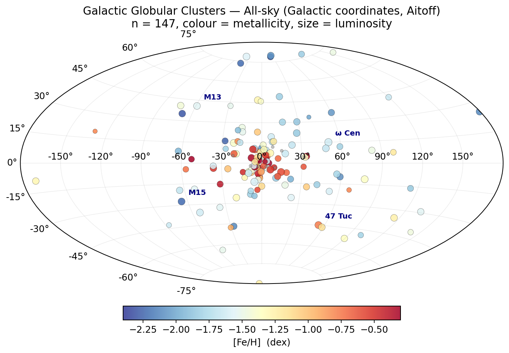 | 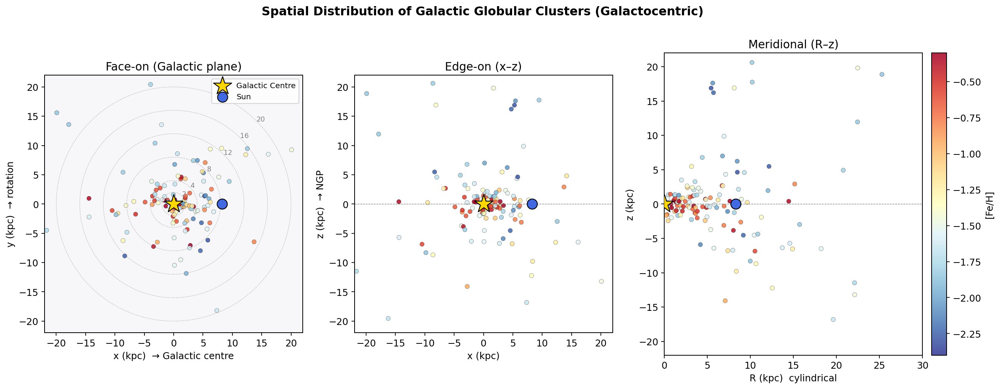 |
| 全天 Aitoff 投影 | 银心俯视/侧视 |
| 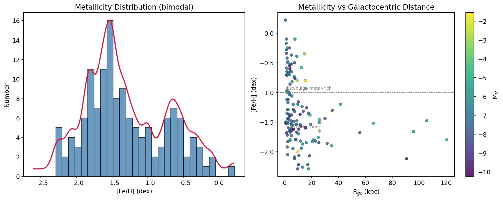 | 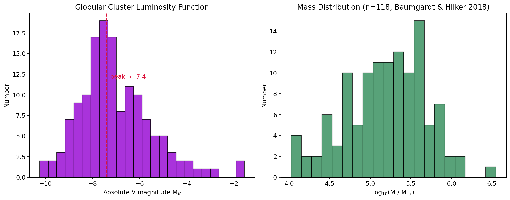 |
| 金属丰度双峰 | 光度/质量函数 |
| 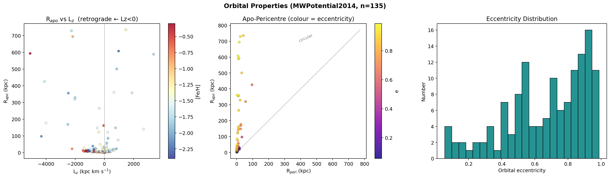 | 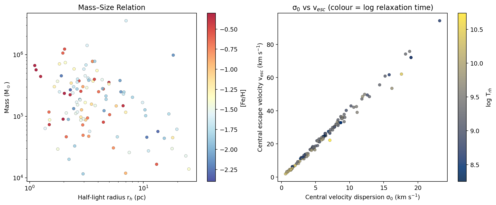 |
| 轨道相空间 | 质量-半径/动力学 |

### Web 应用截图 App Screenshots

| | |
|---|---|
|  | 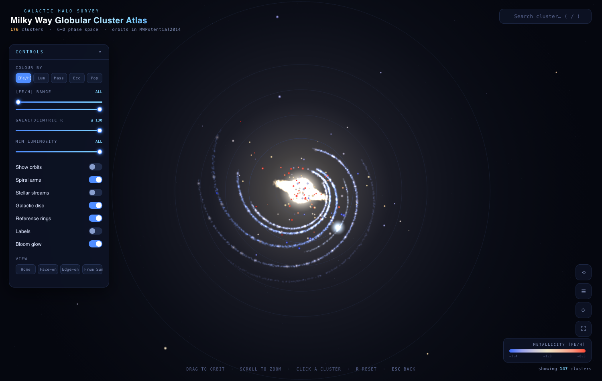 |
| 3/4 视角总览 | 旋臂科学仿真 |
| 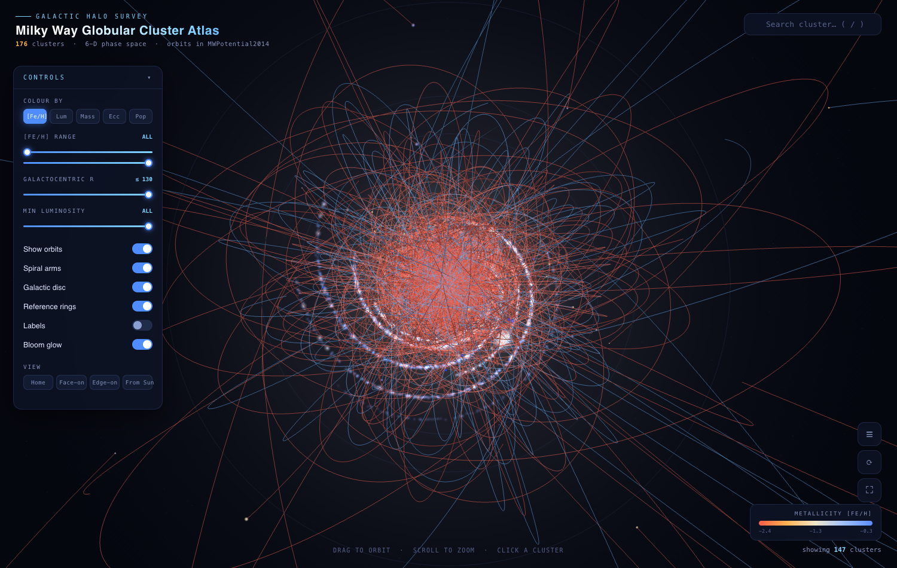 | 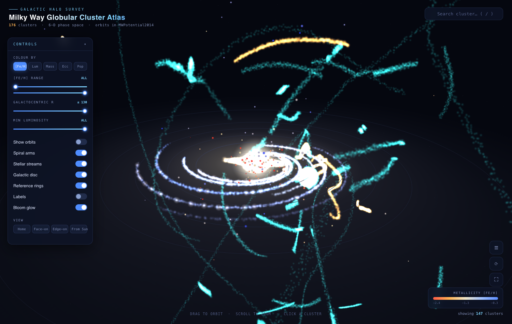 |
| 135 条平滑轨道 | 124 条点状恒星流 |
| 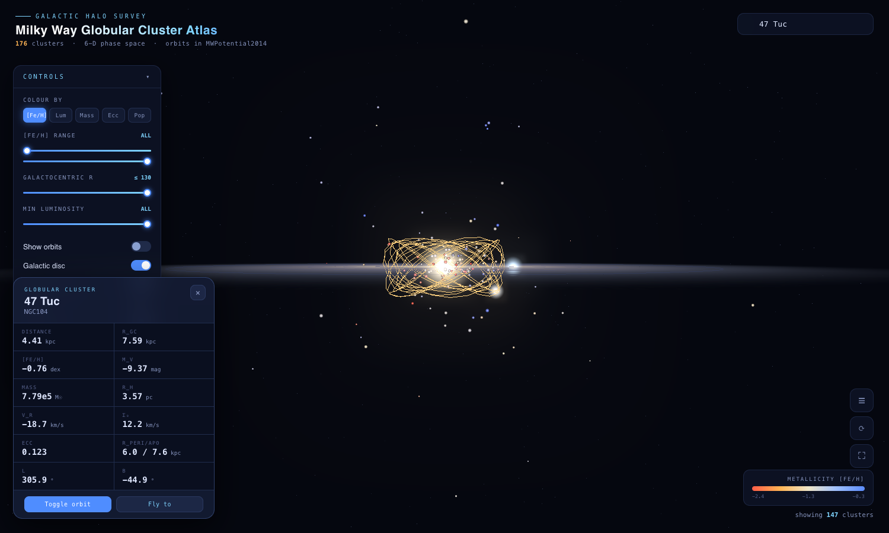 | 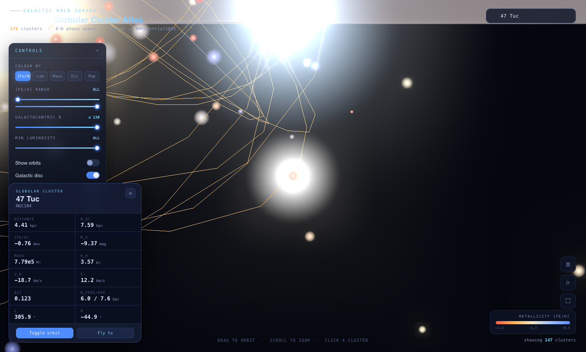 |
| Edge-on 盘轨道 | 信息卡 + 搜索 |

---

## 🌐 接入个人网页 Embedding

本项目是**纯静态、零依赖**站点，可整体作为子目录放进任何静态托管
（含 [GitHub Pages](https://pages.github.com/)）：

- 直接访问入口即 `viz/index.html`。将本仓库内容放到个人站点的某个子路径
  （如 `.../projects/globular-cluster-atlas/`），链接到该路径下的 `viz/` 即可。
- 因为不使用 ES module / fetch / 后端，`file://` 与任何子路径托管都能正常工作，
  无需额外配置。

---

## ⚠️ 说明与局限 Notes

- 距离/自行/视向速度的不确定度未纳入轨道积分（输出为标称轨道中心值）。
- 银河势为静态轴对称模型，未含银棒、旋臂、LMC 潮汐等非轴对称/时变项。
- 少数星团（主要为 Bica 2019 新候选）缺 Gaia 6D 数据，故无轨道。
- 坐标变换与引力势为独立自实现（规避 astropy/galpy 依赖），关键量已经文献值校验。
- 旋臂/棒/核球为**科学参数化的粒子仿真**（示意性分布，非逐星实测）。

## 📚 参考 References

- Harris W.E. 1996, AJ, 112, 1487（2010 修订）
- Vasiliev E. & Baumgardt H. 2021, MNRAS, 505, 5978
- Baumgardt H. & Hilker M. 2018, MNRAS, 478, 1520
- Bica E. et al. 2019, AJ, 157, 12
- Bovy J. 2015, ApJS, 216, 29（MWPotential2014）
- Reid M.J. et al. 2019, ApJ, 885, 131（旋臂）
- Vallée J.P. 2017（旋臂综述）
- Wegg C. et al. 2015（中心棒）
- Mateu C. 2023, galstreams（恒星流汇编）
- 数据经由 CDS VizieR（斯特拉斯堡天文数据中心）获取

---

## 📄 License

[MIT](LICENSE) © Jianxing Chen. 数据版权归原作者所有（见 LICENSE 附注）。

*Made with Three.js · 数据精确 · 完全本地 · 开放可视化*
