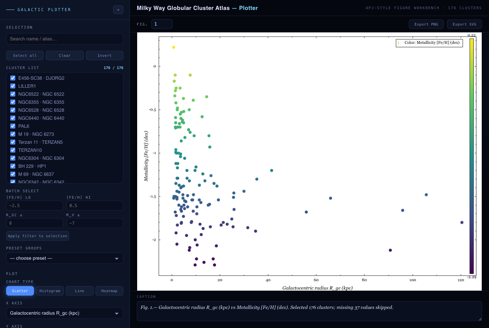
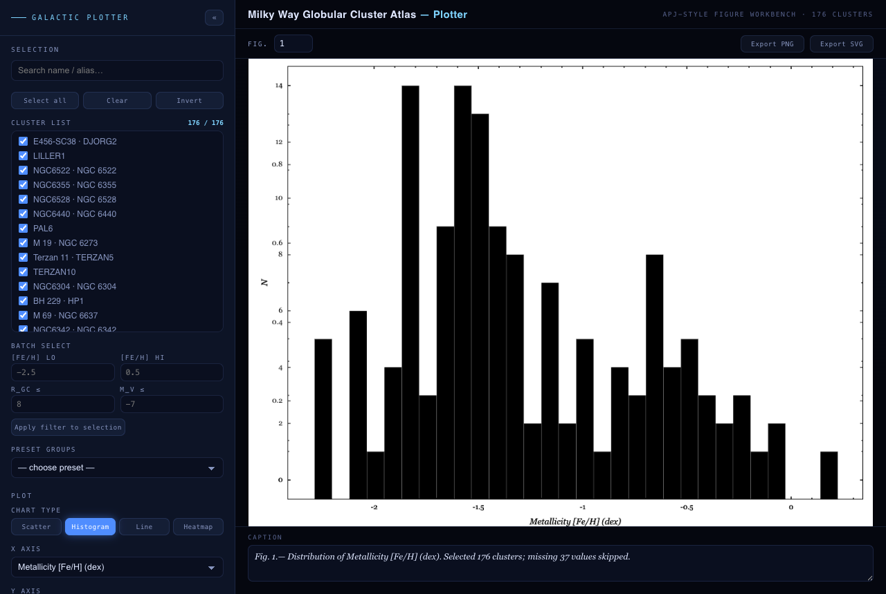

# 🌌 Milky Way Globular Cluster Atlas

**English** | [中文](README.zh-CN.md)

> An interactive atlas of **176 Milky Way globular clusters** — multi-survey catalog cross-match,
> **orbit integration** in MWPotential2014 (135 smooth orbits), **124 stellar streams** (galstreams),
> and a **scientific spiral-arm & bar model**, all rendered in a zero-install, double-click
> **3D web explorer** (Three.js). Fully offline, fully self-contained.

[](https://jianxing-chen.github.io/globular-cluster-atlas/)
[](LICENSE)
[](https://github.com/jianxing-chen/globular-cluster-atlas)


---

## 🔴 Live Demo

| Entry | URL |
|-------|-----|
| **Project portal** (landing page) | https://jianxing-chen.github.io/globular-cluster-atlas/ |
| **3D explorer** (direct) | https://jianxing-chen.github.io/globular-cluster-atlas/viz/ |
| **Plotter** (direct) | https://jianxing-chen.github.io/globular-cluster-atlas/plotter/ |

Hosted on GitHub Pages — fully static, no build step, no backend.

---

## ✨ Highlights

| Feature | Content |
|---------|---------|
| **Master catalog** | **176** globular clusters, cross-matched from 4 surveys |
| **6-D phase space** | **135** clusters with position + proper motion + radial velocity |
| **Orbit integration** | **135** smooth orbits, MWPotential2014, back-integrated 3 Gyr |
| **Stellar streams** | **124** Milky Way streams (galstreams), 18 linked to GC progenitors |
| **Galaxy model** | 4 major spiral arms + Local Arm + Outer arm + central bar + bulge |
| **Static figures** | 6 publication-quality plots |
| **Plotter** | APJ-style figure workbench — 6 templates, color mode, error bars, SVG/PNG export |
| **3D web app** | offline, zero-install, ~120 fps |
| **Project portal** | English landing page with figure lightbox & cited sources |

---

## 🚀 Quick Start

### 3D explorer (no installation — just open)
```bash
git clone git@github.com:jianxing-chen/globular-cluster-atlas.git
cd globular-cluster-atlas
open viz/index.html        # macOS
# start viz\index.html     # Windows
# xdg-open viz/index.html  # Linux
```
> Works in any modern browser (Chrome / Edge / Firefox / Safari) straight from `file://` —
> plain classic scripts, no ES modules, no network requests, fully offline.

### Plotter (publication figure workbench)
```bash
open plotter/index.html        # macOS
# start plotter\index.html     # Windows
# xdg-open plotter/index.html  # Linux
```
> Check clusters in the 176-row list (or batch/preset filters), pick a chart type and axes,
> and export an APJ-style figure. Six one-click templates (`R_gc vs [Fe/H]`, metallicity,
> distance, `M_V vs Mass`, eccentricity, pericentre/apocentre), viridis color mode, error bars,
> log axes, group overlays — SVG or 300-dpi PNG export, caption included.

### Controls
- **Drag** to rotate · **scroll** to zoom · **click a cluster** for a full data card
- **`/`** focuses the search box — type a name (`47 Tuc`, `omega Cen`, `M13`) → Enter to fly there
- **`R`** or the ⟲ button resets view &amp; filters · **`Esc`** closes the info card / deselects
- Left panel: 5 colour codings (metallicity / luminosity / mass / eccentricity / population),
  metallicity / galactocentric-radius / luminosity filters, toggles for **orbits**, **spiral arms**,
  **stellar streams**, disc, rings, labels, bloom, and 4 view presets (Home / Face-on / Edge-on / From-Sun)
- Info card: **Toggle orbit** shows the cluster's smooth orbit; **Fly to** zooms to it

### Reproduce the data pipeline (optional)
```bash
cd scripts
python3 download_catalogs.py    # 1 fetch catalogs from VizieR
python3 parse_and_validate.py   # 2 parse + validate
python3 build_master.py         # 3 merge master catalog
python3 integrate_orbits.py     # 4 orbit integration (MWPotential2014)
python3 process_streams.py      # 5 stellar streams (clone galstreams to /tmp/galstreams first)
python3 make_figures.py         # 6 static figures
python3 export_viz_data.py      # 7 bundle data for the web app
```
Dependencies: `numpy pandas matplotlib scipy` (orbits/figures are self-implemented; no astropy/galpy needed).

---

## 📊 Data Sources

All catalogs verified against their official CDS VizieR identifiers.

| Catalog | VizieR ID | Content | Rows |
|---------|-----------|---------|------|
| [Harris 1996/2010](https://vizier.cds.unistra.fr/viz-bin/VizieR?-source=VII/202) | `VII/202/catalog` | Coordinates, distances, photometry, [Fe/H], E(B−V), RV, structure, relaxation, densities (38 cols) | 147 |
| [Vasiliev & Baumgardt 2021](https://vizier.cds.unistra.fr/viz-bin/VizieR?-source=J/MNRAS/505/5978) | `J/MNRAS/505/5978/tablea1` | Gaia EDR3 proper motions + parallaxes (→ distances) | 170 |
| [Baumgardt & Hilker 2018](https://vizier.cds.unistra.fr/viz-bin/VizieR?-source=J/MNRAS/478/1520) | `J/MNRAS/478/1520/table2` | Masses, M/L, half-light radii, relaxation, escape velocities, σ₀ | 112 |
| [Bica et al. 2019](https://vizier.cds.unistra.fr/viz-bin/VizieR?-source=J/AJ/157/12) | `J/AJ/157/12/table3` | Milky Way clusters & candidates (incl. new GC candidates) | 10978 |
| [galstreams (Mateu 2023)](https://github.com/cmateu/galstreams) | `github.com/cmateu/galstreams` | Stellar-stream 6-D tracks (GD-1, Pal 5, Orphan-Chenab, …) | 124 streams |

**Merge strategy** — names normalized (aliases → Harris key) + coordinate cross-match (3″).
Priority: distance `Baumgardt&Hilker > Gaia parallax > Harris`; coordinates/PM from Gaia EDR3;
metallicity/reddening/colours from Harris; mass/structure from Baumgardt & Hilker.

**Field coverage** (176 clusters): distance 170 · PM 170 · mass 118 · [Fe/H] 139 · RV 141 · **full 6-D 135**.

---

## 🌠 Galaxy Model

The disc is not a schematic — it is a science-parameterized particle simulation:

- **Spiral arms**: 4 major arms (Scutum-Centaurus, Sagittarius-Carina, Perseus, Norma-Outer)
  + Outer arm + Local Arm (Orion Spur), log-spiral `R(β)=R_ref·exp(−(β−β_ref)·tan ψ)`,
  pitch 8–16° — parameters from **Reid et al. 2019** (VLBI parallaxes) & **Vallée 2017**.
- **Central bar**: half-length 5 kpc, tilted 28° (**Wegg et al. 2015**) + boxy/peanut bulge.
- **HII knots**: young star-forming regions sprinkled along the major arms.

### Stellar streams (galstreams)
**124** stream tracks (Mateu 2023) — the tidal debris of globular clusters & dwarf galaxies,
physically kin to the accreted GCs, together telling the Galaxy's merger history.
- **Teal** = general streams · **gold** = streams with a GC progenitor (Pal 5, ω Cen-Fimbulthul,
  NGC 3201-Gjöll, … auto-linked to the master catalog)
- Rendered as point-density ribbons (smoothed spine + Gaussian cross-spread)

---

## 🔬 Orbit Integration

- **Potential**: `MWPotential2014` (Bovy 2015) = Hernquist bulge + Miyamoto-Nagai disk + NFW halo,
  calibrated to v_c(R☉) = 238 km/s.
- **Transform**: self-implemented IAU 1958 (validated on 47 Tuc), heliocentric → galactocentric.
- **Integrator**: scipy `DOP853` (8th-order RK), back 3 Gyr, rtol=1e-7.
- **Sun**: R☉=8.275 kpc, v☉=(11.1, 251.24, 7.25) km/s, z☉=20.8 pc.
- **Output**: smooth orbit + R_peri / R_apo / eccentricity / z_max / prograde-vs-retrograde.

---

## ✅ Validation

| Check | Result | Status |
|-------|--------|--------|
| Row counts vs VizieR | 147 / 170 / 112 / 10978 | ✓ match |
| Coordinate consistency (Harris vs Gaia EDR3) | median offset 0.048′ (≈3″) | ✓ reliable |
| Circular velocity at the Sun | 238.0 km/s | ✓ MWPotential2014 |
| 47 Tuc Galactic coordinates | l=305.89°, b=−44.89° | ✓ lit. 305.90, −44.89 |
| Orbit start vs catalog position | offset ≈ 0.02 kpc | ✓ same frame |
| Online 3D app (headless test) | 176 GC / 124 streams / 0 JS errors / 120 fps | ✓ pass |

**Spot-check clusters** (match the literature):

| Cluster | Distance | [Fe/H] | Mass | ecc |
|---------|----------|--------|------|-----|
| 47 Tuc (NGC 104) | 4.41 kpc | −0.76 | 7.79×10⁵ M☉ | 0.12 (disc) |
| ω Cen (NGC 5139) | 5.20 kpc | −1.62 | 3.55×10⁶ M☉ (most massive) | 0.69 |
| M13 (NGC 6205) | 6.60 kpc | −1.54 | 4.53×10⁵ M☉ | 0.81 |

---

## 🌐 The Project Portal (landing page)

The repo root serves an **English project portal** (`index.html`) with:
- Hero + stats + 3D preview (click to launch)
- **App hub** — entry cards for the 3D explorer and the plotter figure workbench
- Catalog field-coverage & spot-check tables
- **Clickable source cards** linking to each VizieR catalog / GitHub / ADS reference
- Galaxy-model & orbit summaries, a validation table
- **Figure gallery with a lightbox** (click to enlarge, ←/→ or Esc to navigate)
- Reproduction instructions

---

## 📁 Repository Structure

```
GlobularClusterAtlas/
├── index.html               # ★ project portal (landing page, EN)
├── viz/                     # ★ 3D web app (self-contained; open viz/index.html)
│   ├── index.html
│   ├── app.js               # Three.js app (plain classic script, no modules)
│   ├── gc_data.js           # 176 clusters + 135 orbits
│   ├── streams_data.js      # 124 stellar streams
│   └── assets/              # three.min.js + OrbitControls (local, offline)
├── plotter/                 # ★ APJ-style figure workbench (open plotter/index.html)
│   ├── index.html
│   └── plotter.js           # scatter/hist/line/heat renderers + SVG/PNG export
├── webdata/                 # shared data bundles for the web apps
│   └── plotter_data.js      # 176-cluster subset (params used by the plotter)
├── data/
│   ├── raw/                 # raw VizieR TSV (4 catalogs)
│   └── processed/           # master_catalog.csv/.json/.pkl, orbits.json
├── scripts/                 # 7 pipeline scripts
├── figures/                 # 6 static figures + app screenshots
├── README.md                # this file (English)
├── README.zh-CN.md          # 中文说明
├── LICENSE                  # MIT
└── .gitignore
```

---

## 🖼️ Gallery

| | |
|---|---|
|  |  |
| All-sky Aitoff (metallicity) | Galactocentric views |
|  |  |
| Metallicity bimodality | Luminosity & mass functions |
|  |  |
| Orbital phase space | Mass–size / dynamics |

### Web app screenshots

| | |
|---|---|
|  |  |
| 3/4 overview | Spiral-arm model |
|  |  |
| 135 smooth orbits | 124 stellar streams |
|  |  |
| Edge-on disc orbit | Info card + search |

### Plotter workbench

| | |
|---|---|
|  |  |
| R_gc vs [Fe/H] — color mode | Metallicity distribution |

---

## ⚠️ Notes & Limitations

- Distance/PM/RV uncertainties are not propagated into the orbits (nominal central values).
- The potential is static & axisymmetric (no bar, arms, or LMC tides).
- A few clusters (mostly Bica 2019 candidates) lack Gaia 6-D data, hence no orbit.
- The coordinate transform & potential are independently self-implemented (to avoid astropy/galpy
  dependency issues); key quantities are validated against literature values.
- Spiral arms / bar / bulge are science-parameterized particle simulations (illustrative
  distributions, not star-by-star measurements).

## 📚 References

- Harris W.E. 1996, AJ, 112, 1487 (2010 revision)
- Vasiliev E. & Baumgardt H. 2021, MNRAS, 505, 5978
- Baumgardt H. & Hilker M. 2018, MNRAS, 478, 1520
- Bica E. et al. 2019, AJ, 157, 12
- Bovy J. 2015, ApJS, 216, 29 (MWPotential2014)
- Reid M.J. et al. 2019, ApJ, 885, 131 (spiral arms)
- Vallée J.P. 2017 (spiral-arm review)
- Wegg C. et al. 2015, MNRAS, 450, 4050 (Galactic bar)
- Mateu C. 2023, MNRAS, 520, 5225 (galstreams)
- Data via [CDS VizieR](https://vizier.cds.unistra.fr/) (Strasbourg Astronomical Data Center)

---

## 📄 License

[MIT](LICENSE) © Jianxing Chen. Data remain the property of their respective authors (see LICENSE note).

*Made with Three.js · precise data · fully offline · open visualization*
